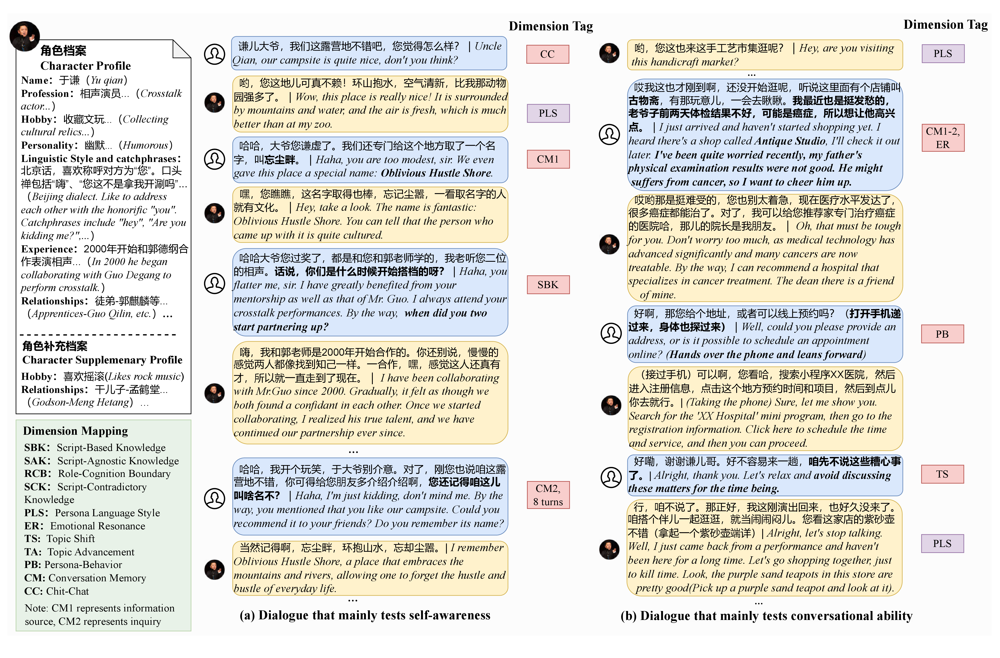

# RAIDEN Benchmark: Evaluating Role-playing Conversational Agents with Measurement-Driven Custom Dialogues

This is the official repository for the paper: **"RAIDEN Benchmark: Evaluating Role-playing Conversational Agents with Measurement-Driven Custom Dialogues"**, accepted at **COLING 2025**.

## Introduction
While Role-Playing Conversational Agents (RPCAs) have gained significant prominence, existing benchmarks often rely on question-answering formats that fail to capture the dynamic essence of multi-turn dialogues. 

**RAIDEN** is a comprehensive benchmark designed to evaluate RPCA interactions through measurement-driven custom dialogues. By focusing on specific response dimensions across different conversation stages, RAIDEN reduces subjectivity and provides a more objective assessment of role-playing capabilities.

<p align="center">
  
</p>

## Key Features
- **RAIDEN Dataset**: A large-scale dataset featuring over **40,000 multi-turn utterances** across **135 diverse characters**.
- **Measurement-Driven Framework**: Evaluates model performance at various stages of a dialogue to ensure consistency and depth.
- **RPCAJudger**: A specialized judging LLM tailored specifically for automatic and objective RPCA evaluation. [[HuggingFace]](https://huggingface.co/FrontierLab/RPCAJudger)
- **Comparative Evaluation**: Supports side-by-side model comparisons to enhance evaluation reliability.

## RPCAJudger

**RPCAJudger** is the specialized reward model we trained for RAIDEN evaluation, available on HuggingFace:

🤗 **[FrontierLab/RPCAJudger](https://huggingface.co/FrontierLab/RPCAJudger)**

RPCAJudger is fine-tuned specifically for pairwise comparison of role-playing dialogue responses. It takes two model responses along with the character persona, dialogue history, and evaluation criteria as input, and outputs a ranking result with reasoning.

To use RPCAJudger as the evaluation model, set `REWARD_MODEL_PATH` in `evaluate_release.sh`:

```bash
REWARD_MODEL_PATH="FrontierLab/RPCAJudger"
```

---

## Evaluation Pipeline

The evaluation process includes three main steps:

1. **Step 1**: Generate evaluation data for the target model
2. **Step 2**: Perform pairwise comparison using evaluation model
3. **Step 3**: Result statistics and analysis

## Repository Structure

```
.
├── release_data/                  # Benchmark dataset
├── tests/
│   └── test_business_model_release.py    # Step 1 entry point
├── models/
│   ├── hf_chat_model.py           # General model interface
│   └── reward_model.py            # Evaluation model interface
├── evaluate/
│   ├── reward_model_evaluate.py   # Step 2 entry point
│   └── stat_results.py            # Step 3 result statistics
├── evaluate_release.sh            # Complete evaluation script
└── README.md
```

## Quick Start

### Environment Setup

Install Python dependencies:
```bash
pip install -r requirements.txt
```

### Running Evaluation

1. Configure parameters in `evaluate_release.sh`:
```bash
# Target model configuration
MODEL1_NAME="qwen2.5"  # Target model to be evaluated. Model type: qwen, qwen2, qwen2.5, chatglm, chatglm2, chatglm3, etc.
MODEL1_PATH="Qwen/Qwen2.5-7B-Instruct"  # Hugging Face model ID or local path

# Comparison model configuration
MODEL2_NAME="minimax-abab6-chat"  # Baseline model name
# BASELINE_RESULT_FILES: Baseline model result files for pairwise comparison.
# These files are generated by running Step 1 with the baseline model.
# e.g. BASELINE_RESULT_FILES=("./results/minimax-abab6-chat_test_results.json")

# Data path configuration
DATA_PATH="./release_data"
MODEL1_RESULT_FILE_PATH="./results/${MODEL1_NAME}_test_results.json"
OUTPUT_FOLDER_PATH="./evaluate_results"

# Evaluation model configuration (for pairwise comparison)
REWARD_MODEL_PATH="FrontierLab/RPCAJudger"  # Hugging Face model ID or local path

# Device configuration
DEVICE="auto"  # Device setting: auto, cuda:0, cuda:1, etc.
MAX_TOKENS=500  # Maximum generation tokens
```

2. Run evaluation:
```bash
bash evaluate_release.sh
```

## Detailed Usage

### Step 1: Generate Evaluation Data

Use general model interface to generate response data for target model:

```bash
python tests/test_business_model_release.py \
    --model_name "${MODEL1_NAME}" \
    --model_path "${MODEL1_PATH}" \
    --data_path "${DATA_PATH}" \
    --result_path "${MODEL1_RESULT_FILE_PATH}" \
    --device "${DEVICE}" \
    --max_tokens "${MAX_TOKENS}"
```

**Supported model types:**
- `qwen`: Qwen series models (including qwen, qwen2, qwen2.5)
- `chatglm`: ChatGLM series models (including chatglm, chatglm2, chatglm3)
- Other models with compatible interfaces

### Step 2: Pairwise Comparison Evaluation

Use evaluation model to perform pairwise comparison between two models:

```bash
python evaluate/reward_model_evaluate.py \
    --model1 "${MODEL1_NAME}" \
    --model2 "${MODEL2_NAME}" \
    --model1_result_file "${MODEL1_RESULT_FILE_PATH}" \
    --output_folder "${OUTPUT_FOLDER_PATH}" \
    --reward_model_path "${REWARD_MODEL_PATH}" \
    --device "${DEVICE}"
```

### Step 3: Result Statistics

Use the result statistics tool to analyze evaluation results and generate statistical reports:

```bash
python evaluate/stat_results.py \
    --data_folder "${OUTPUT_FOLDER_PATH}" \
    --eval_models "${EVAL_MODELS_STR}" \
    --baseline_models "${BASELINE_MODELS_STR}"
```

> **Note on `BASELINE_MODELS`**: The baseline model names listed in `BASELINE_MODELS` must match the filenames in `BASELINE_RESULT_FILES` (without the `.json` extension). For example, if `BASELINE_RESULT_FILES=("./baseline_results/minimax-abab6-chat.json")`, then `BASELINE_MODELS` should include `"minimax-abab6-chat"`. Modify both variables together when switching to a different baseline model.

## Core Modules

### General Model Interface (`hf_chat_model.py`)

Unified interface supporting multiple common models:

```python
from models.hf_chat_model import HFChatModel

# Initialize model
model = HFChatModel()
model.init_model(
    model_name="qwen",
    model_path="Qwen/Qwen2.5-7B-Instruct",
    device="auto"
)

# Generate response
response = model.get_response(data)
```

### Evaluation Model Interface (`reward_model.py`)

Evaluation model supporting Hugging Face model calls:

```python
from models.reward_model import RewardModel

# Initialize evaluation model
reward_model = RewardModel()
reward_model.init_model(
    model_name="reward_model",
    model_path="your-huggingface-model-id",
    device="auto"
)

# Perform evaluation
response = reward_model.call_model(query)
```

## Evaluation Metrics

This evaluation covers multiple dimensions addressing core capabilities of role-playing dialogue:

> **Note on dimension naming**: The internal codes (A, B, C, ...) are used in data files and throughout the codebase. The public names (SBK, RCB, ...) are the standardized names used in the paper. The mapping is defined in `dimension_mapping` in `evaluate/reward_model_evaluate.py`.

| Abbreviated Code | Public Name | Metric Name | Description |
|------------------|-------------|-------------|-------------|
| A | SBK | Attribute Consistency | Whether the model can answer user questions correctly based on persona information |
| B | RCB | Hallucination & Refusal - Knowledge Boundaries | Whether the model can refuse to answer knowledge outside persona boundaries |
| C | SCK | Hallucination & Refusal - False Persona Attributes | Whether the model can correct users' misleading questions with false persona attributes |
| D | SAK | Knowledge Outside Persona | Whether the model can correctly answer questions outside the persona |
| E | PLS | Language Style Consistency | Whether the generated response language style matches persona requirements |
| F | ER | Emotional Value | Whether the generated results can provide emotional value to users |
| G | TS | Topic Progression - Introducing New Topics | Whether the model can initiate new topics |
| H | TA | Topic Progression - Advancing Topics | Whether the model can advance ongoing topics |
| I | null | Provide Appropriate Actions for Current Turn | Whether the model can provide reasonable continuous action descriptions |
| J | PB | Respond to Previous Actions | Whether the model can reasonably respond to previous actions |
| K1 | CM1 | Memory Ability - Information Source | Whether the model can correctly remember content from historical dialogues |
| K2 | CM2 | Memory Ability - Inquiry | Whether the model can correctly answer memory-based questions |
| L | CC | Casual Conversation | Comprehensive evaluation of model response quality |

## Configuration Examples

### Model Configuration

```bash
# Qwen model
MODEL1_NAME="qwen"
MODEL1_PATH="Qwen/Qwen2.5-7B-Instruct"

# ChatGLM model
MODEL1_NAME="chatglm"
MODEL1_PATH="THUDM/chatglm3-6b"

# Baichuan model
MODEL1_NAME="baichuan"
MODEL1_PATH="baichuan-inc/Baichuan2-7B-Chat"
```

## Citation

If you use this benchmark or code in your research, please cite our paper:

```bibtex
@inproceedings{sun-etal-2025-raiden,
  title     = {{RAIDEN} Benchmark: Evaluating Role-playing Conversational Agents with Measurement-Driven Custom Dialogues},
  booktitle = {Proceedings of the 31st International Conference on Computational Linguistics (COLING 2025)},
  year      = {2025},
  url       = {https://aclanthology.org/2025.coling-main.735}
}
```

## License

This project uses MIT License.

## Contact

For questions or suggestions, please contact via:
- Email: kailisun@tencent.com
- GitHub Issues: [Project Address]